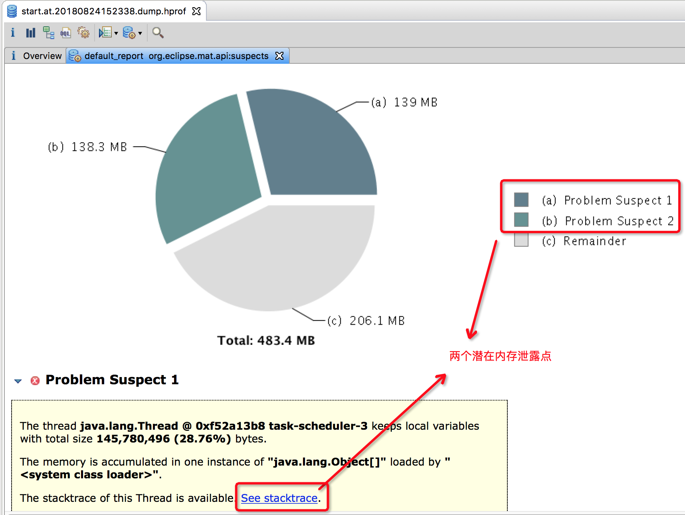

# 问题

- prod12 上 docker 容器运行的 qh-agency-server 经常挂
- prod12 上整个 docker 都挂了 ??? 
- prod13 上 qh-common-admin 挂过几次， qh-admin 挂过一次
- gc 日志 大量 `[GC (Allocation Failure)`
    - 使用 [jstat](https://github.com/btpka3/btpka3/blob/master/java/jstat.md) 分析内存使用状况
        `watch ${JAVA_HOME}/bin/jstat -gcutil ${java进程PID}`
    - 远程 jvisualvm 监控

## 建议


- 阿里云 ECS 升级到 8 vCPU 16 G
- jvm 内存参数适当加大, 使 free 命令的 `available` 为 1G~2G? —— 未确认  

- jvm 上一定要手动明确限定内存参数。
  目前 docker 容器都没有限定内存的，docker 容器内的 java 应用不指定 内存参数，会默认使用宿主机的最大内存做调整的。
  
  - https://developers.redhat.com/blog/2017/03/14/java-inside-docker/
  - https://www.toutiao.com/i6403109459287081474/


- 允许远程 jvisualvm 查看，并在有比较的时候。相关 JVM 参数示例:

    ```bash
    java \
        -Djava.rmi.server.hostname=172.16.11.236 \
        -Dcom.sun.management.jmxremote.port=18888 \
        -Dcom.sun.management.jmxremote=true \
        -Dcom.sun.management.jmxremote.ssl=false \
        -Dcom.sun.managementote.ssl=false \
        -Dcom.sun.management.jmxremote.authenticate=true 
        ...

    # 设置 远程 jvisualvm 的用户名、密码
    # 其中用户 monitorRole 是只读、用户 controlRole 是读写 
    cd $JAVA_HOME/jre/lib/management/
    cp jmxremote.password.template jmxremote.password
    chmod 600 jmxremote.password
    cat >> jmxremote.password <<EOF
    monitorRole password1
    controlRole password2
    EOF
    
    # 如果不想使用用户名、密码，则需要设置 JVM 参数为 `-Dcom.sun.management.jmxremote.authenticate=false`  
    ```
    
    只有检查防火墙是否有开启，开启的话，是否有把上面的端口(18888)开启例外
    
    如果要监控的 jvm 位于云上环境内外，可以临时开启 ssh 隧道，
    使之访问本地(localhost)特定端口，就是访问远程内网服务器的特定端口:

    ```bash
    # 在SSH client端执行
    #ssh sshUser@sshHost -C -f -N -g -L [localBindIP:]localBindPort:remoteServiceIP:remoteServicePort
    ssh sshUser@公网服务器IP -C -f -N -g -L 127.0.0.1:18888:172.16.11.236:18888
    ```
    
- 远程 debug。需要仿照追加 jvm 参数
 `-Xdebug -Xrunjdwp:transport=dt_socket,address=10821,server=y,suspend=n`
 
 需要检查防火墙，可能需要远程隧道。

    

- 完善 jvm 关于 gc，dump 的参数。
        
    ```txt
    -XX:+PrintFlagsInitial      # 打印 JVM 所用的 初始参数
    -XX:+PrintFlagsFinal        # 打印 JVM 所用的 最终参数
    -XX:+PrintCommandLineFlags  # 打印命令行上用户明确指定的 JVM 参数 
    
    # JVM 异常退出时输出相关日志
    -XX:ErrorFile=${DIR_STORE}/logs/start.at.${today}.hs_err_pid.log    
    
    # 内存溢出时 dump 出内存，以便分析 
    -XX:+HeapDumpOnOutOfMemoryError
    -XX:HeapDumpPath=${DIR_STORE}/logs/start.at.${today}.dump.hprof
    
    # 打印 GC 日志
    -XX:+PrintGCDateStamps
    -XX:+PrintGCDetails
    -Xloggc:${DIR_STORE}/logs/start.at.${today}.gc.log
    ```
    
    dump 出来的文件，推荐使用 [Eclipse Memory Analyzer](http://www.eclipse.org/mat/), 内存分析示例
    
    
    


- 在云主机上，增加[阿里云自定义监控](https://help.aliyun.com/document_detail/63275.html)，至少判断 服务是否有挂掉

    - 通过 curl 命令 相关数据。如果觉得 shell 编写麻烦的话，就用最小化的 spring boot 应用取代(建议)。
       通过 http 请求，判断使用是否启动起来。
    - 通过 cron 任务 定时触发
    - 通过 钉钉机器人 发送告警
    - PS: 如果可以，可以监控 jvm 内存使用状况


- 增加 docker 清理的定时任务，参考 [docker system prune](https://docs.docker.com/engine/reference/commandline/system_prune/#description)


