# 示例

## 类图
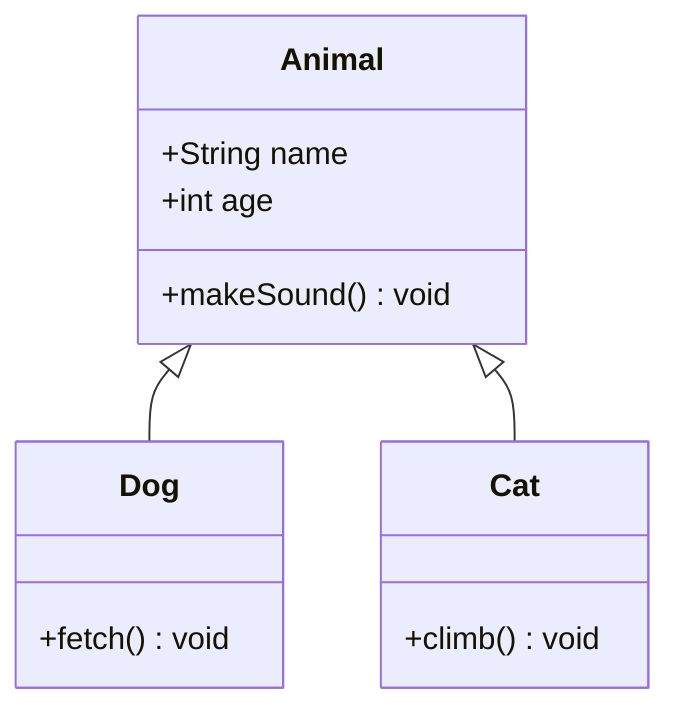

## 时序图
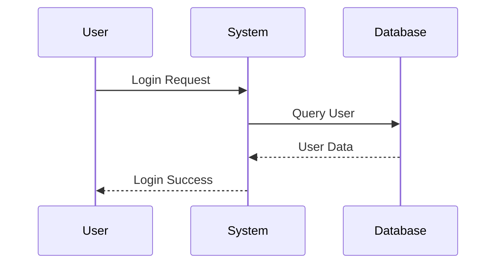

## 活动图
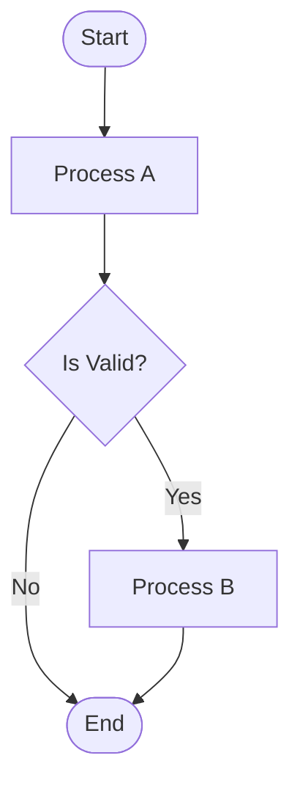

## 状态图
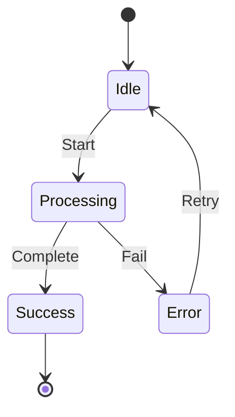

## 组件图
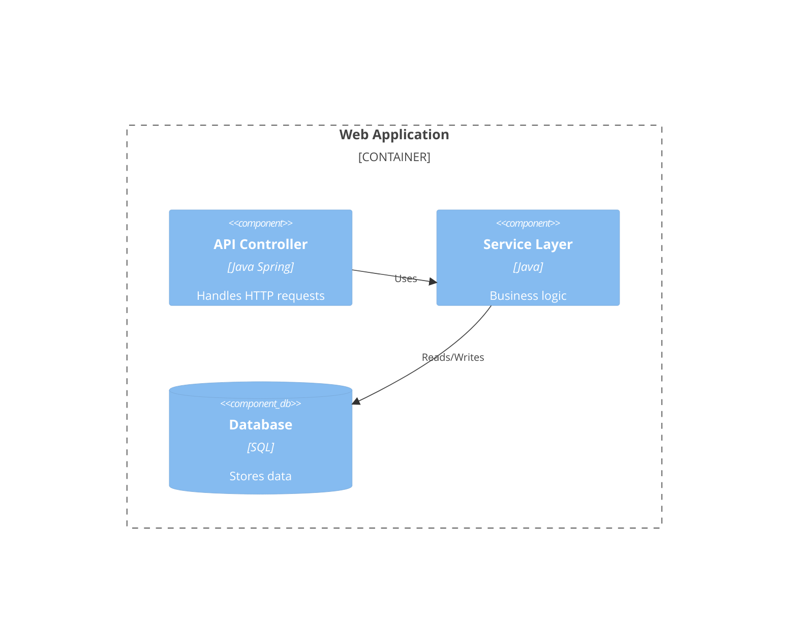

## ER 图
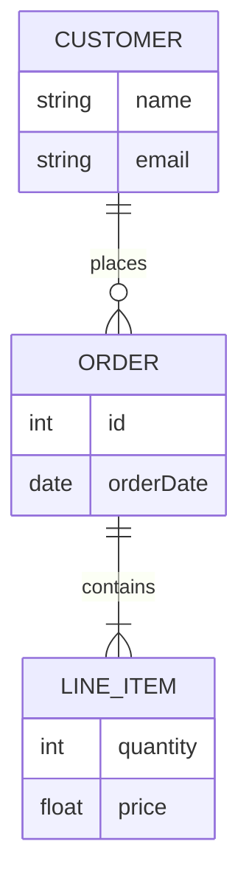

## Sankey 图
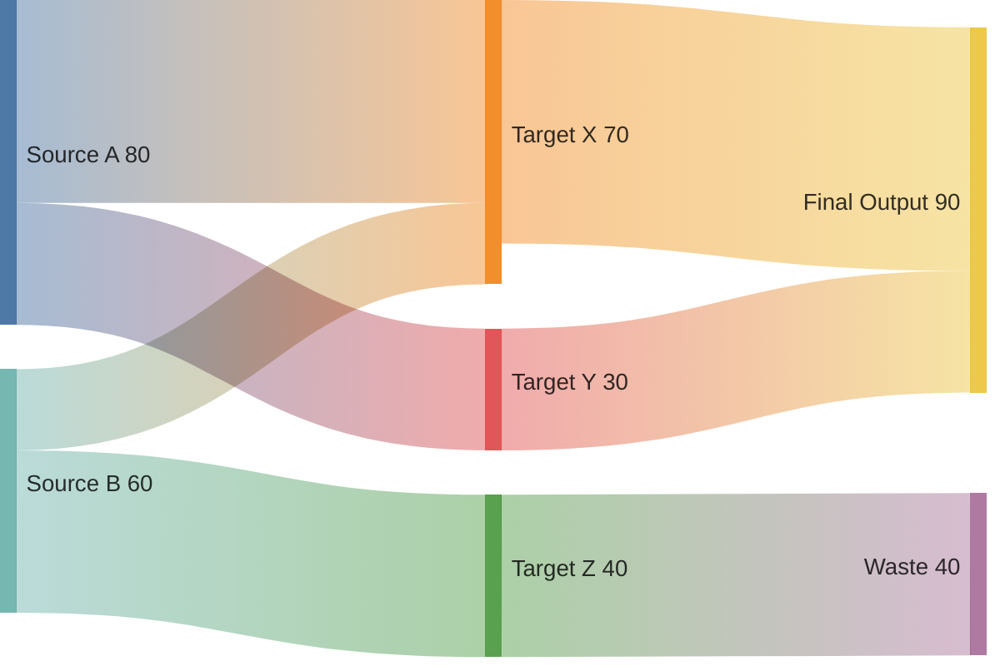

## 象限图示例: 任务优先级管理

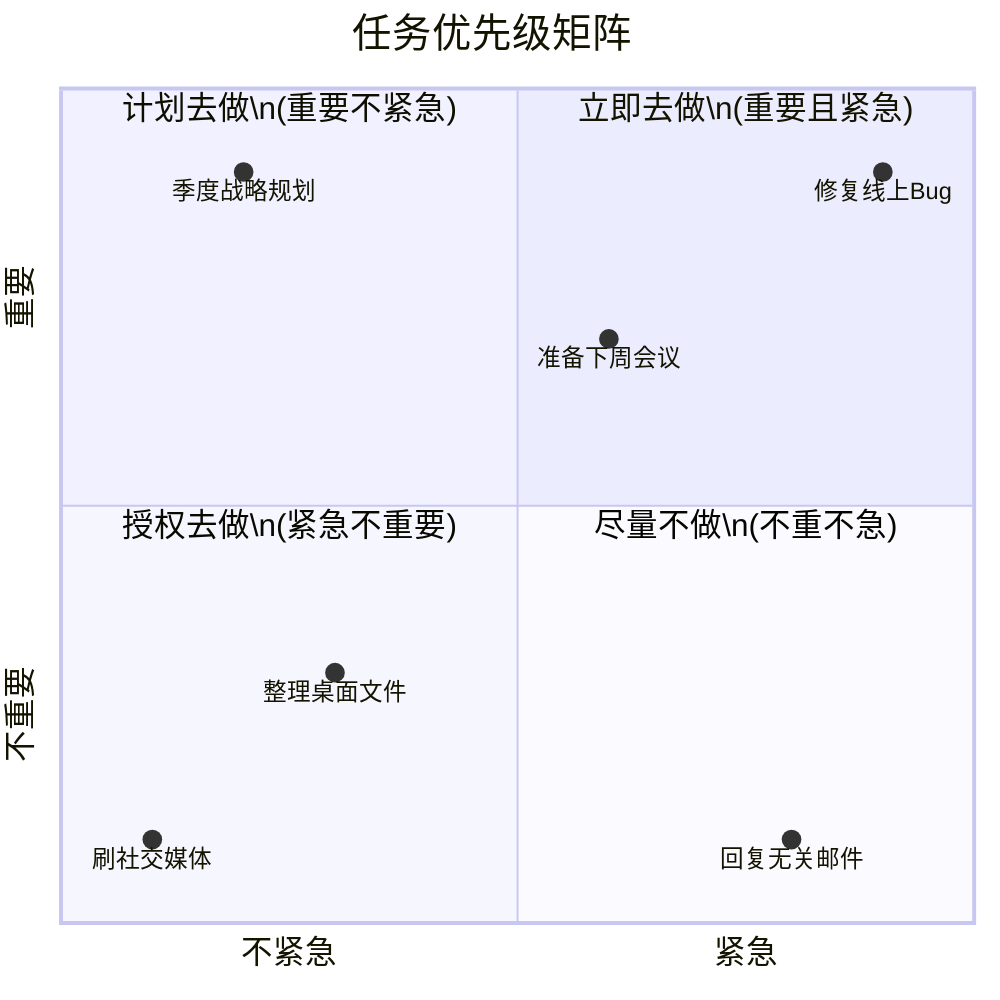

## 思维导图示例： 项目管理核心领域

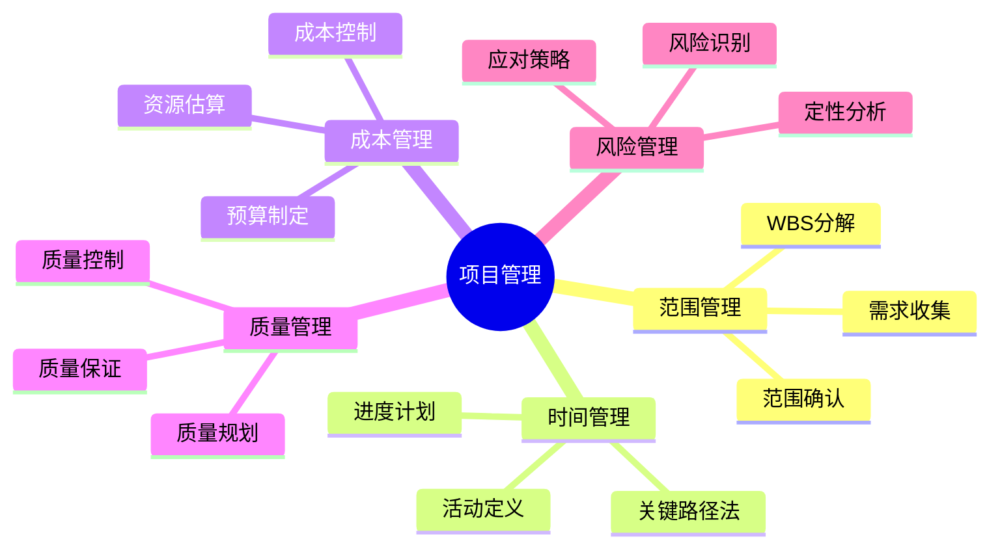

## 饼图示例: IT 项目年度预算分配

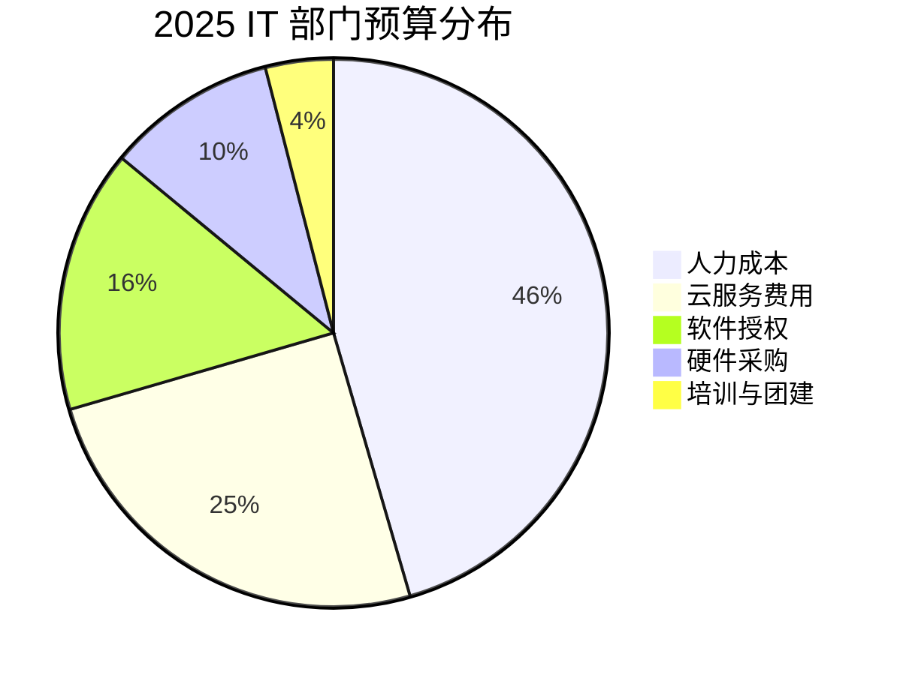

## 甘特图示例: Q4 软件发布计划

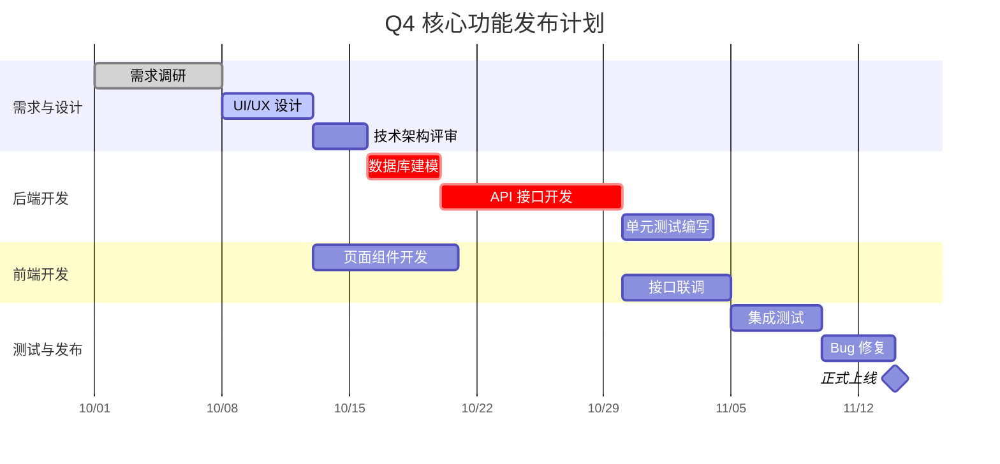

## Git Flow 发布与热修复

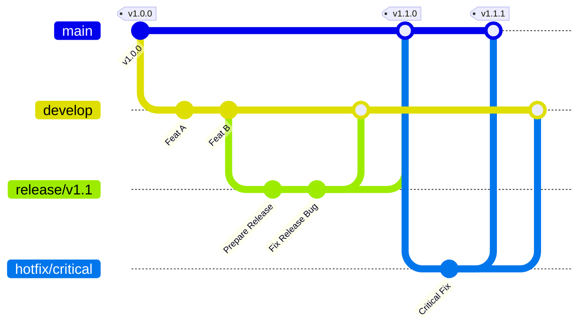

## 用户旅行图

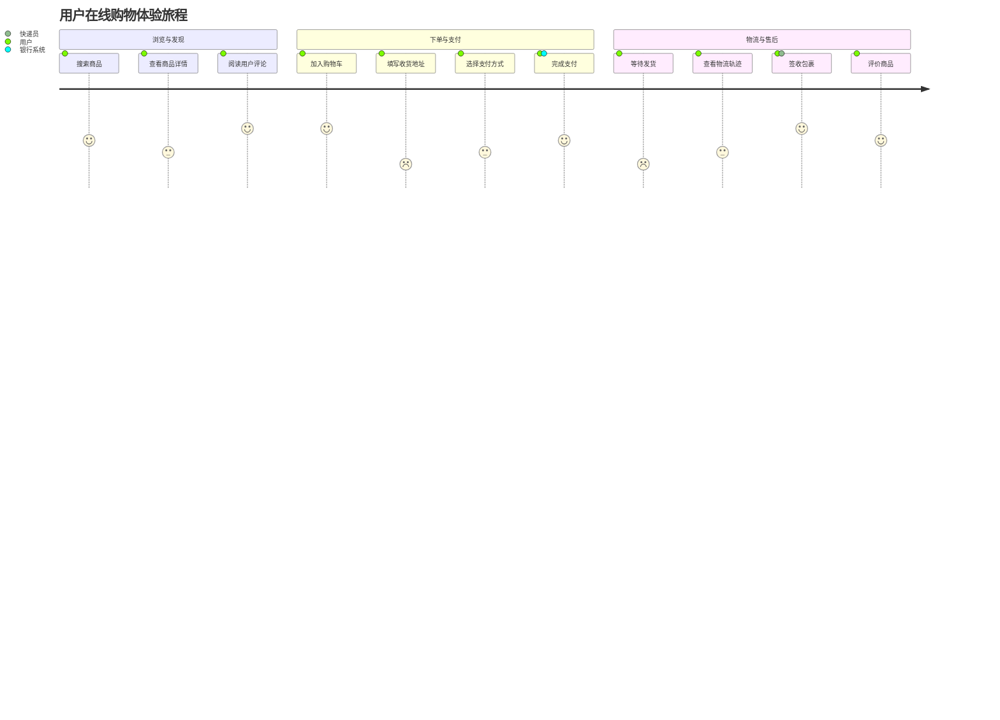

## 流程图
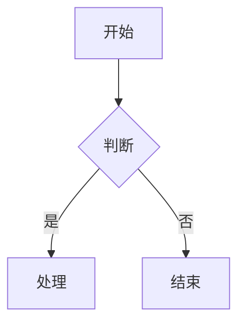

## 时间线图
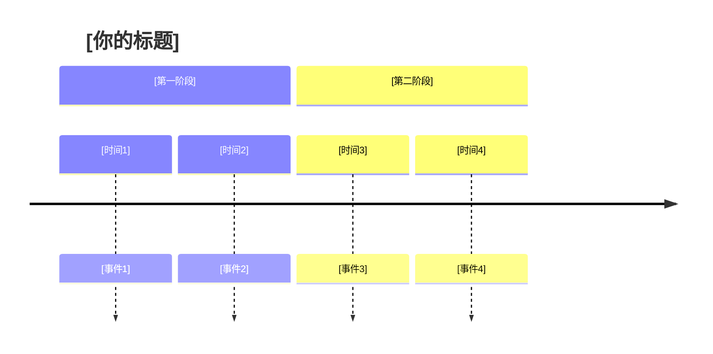

## zenuml 示例

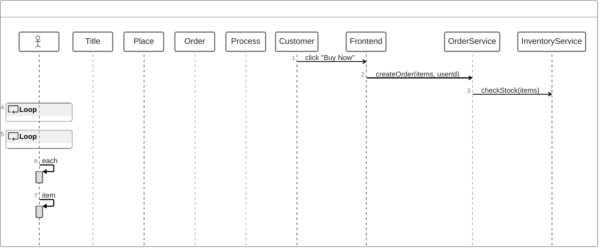

### 时序图

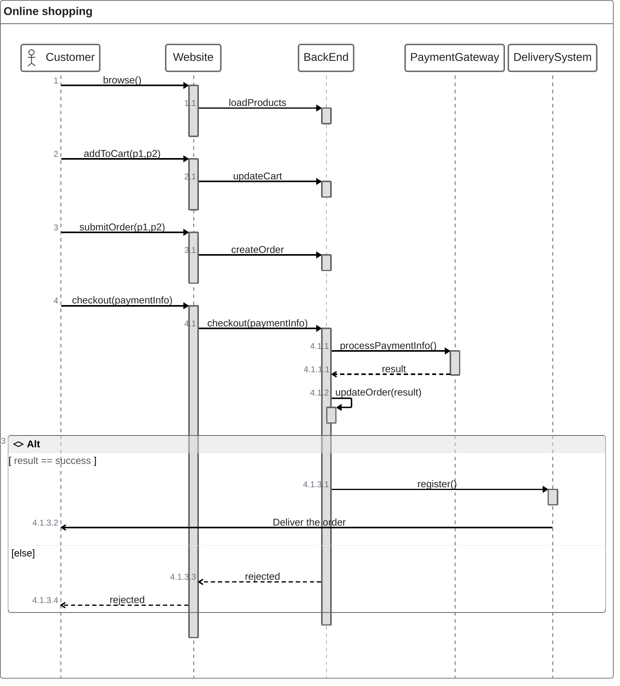

