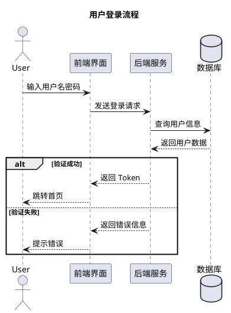
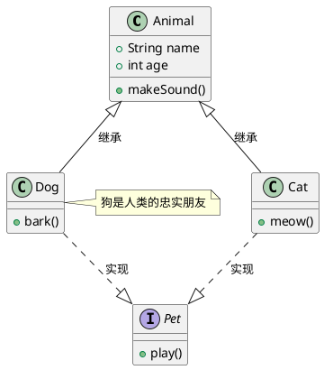
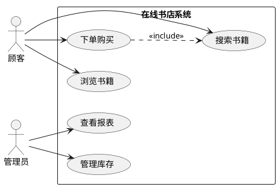
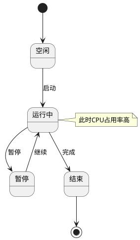
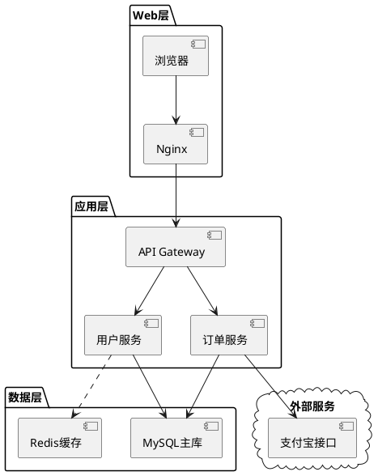

# plantuml 示例

## 时序图 (Sequence Diagram)

## 类图 (Class Diagram)

## 用例图 (Use Case Diagram)

## 活动图 (Activity Diagram) - Beta 语法

## 状态图 (State Diagram)

## 组件图 (Component Diagram)

## 部署图 (Deployment Diagram)

