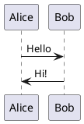

* 《[用Markdown来写自由书籍-开源技术的方案](http://www.ituring.com.cn/article/828)》
* [简书](http://www.jianshu.com/) —— 使用MarkDown来写文章和博客。
* https://github.com/k2052/markdown-to-ebook


## 代码块

```java
public class Demo {
    public static void main(String[] args) {
        System.out.println("hello world");
    }
}
```

[PlantUML](https://plantuml.com/zh/)



